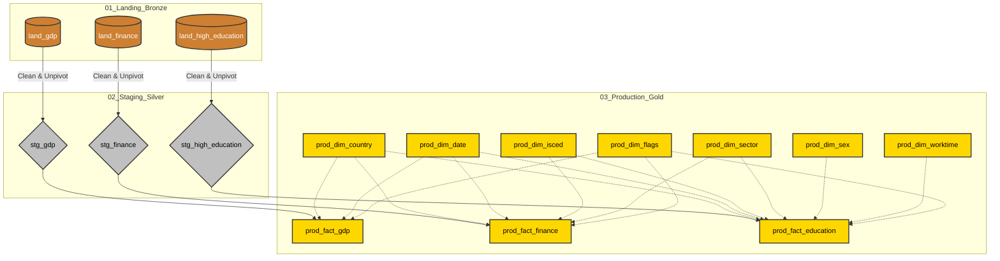
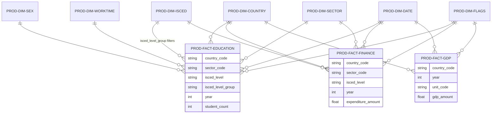
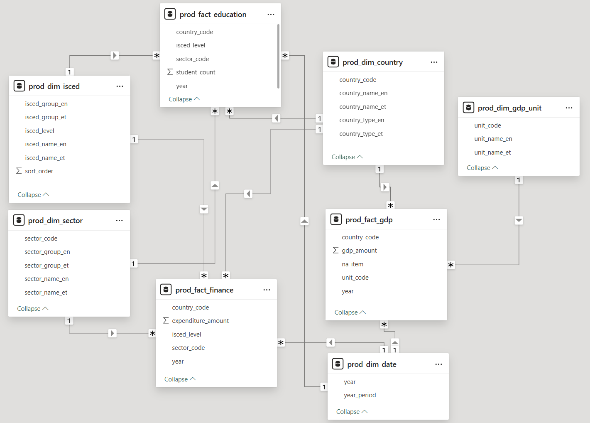

# Euroopa kõrghariduse ja majandusnäitajate analüüs (2012 - 2022)

Antud projekt analüüsib Euroopa kõrghariduse suundumusi, tudengite arvu ja riiklikke hariduskulutusi, kasutades Eurostati andmeid. Projekt on üles ehitatud Medallion-arhitektuuri põhimõttel Google BigQuery keskkonnas.

## 🎯 Analüütilised fookusküsimused
Projekt on loodud vastama järgmistele küsimustele:
- Kuidas korreleerub kõrghariduse rahastamine riigi majandusliku võimekusega (SKP)?
- Erakõrghariduse osakaalu mõju riigiti majandusnäitajatele?
- Millised Euroopa riigid investeerivad kõige rohkem ühe üliõpilase kohta?
- Kuidas on kõrghariduse struktuur ja tudengite arv muutunud võrreldes riikide SKP kasvuga perioodil 2012–2022?
 
 

## 🚀 Projekti etapid
- [x] **I etapp:** Üliõpilaste arv ja struktuur (Eurostat UOE andmed).
- [x] **II etapp:** Hariduse rahastamise andmete integreerimine.
- [x] **III etapp:** Majandusnäitajate (SKP kasv) lisamine ja korrelatsioonianalüüs.
- [ ] **IV etapp:** Visualiseerimine Power BI-s.
 
 

## 📊 Andmeallikad
Analüüsis kasutatakse **Eurostat** avalikke andmebaase:
1. **Üliõpilaste arv ja struktuur:** [educ_uoe_enrt01](https://ec.europa.eu/eurostat/databrowser/view/educ_uoe_enrt01/default/table?lang=en) – hõlmab õppurite arvu riigiti, haridustaseme ja asutuse sektori lõikes.
2. **Hariduse rahastamine:** [educ_uoe_finf01](https://ec.europa.eu/eurostat/databrowser/view/educ_uoe_finf01/default/table?lang=en) – näitab rahavoogusid allikate (avalik/era) ja saajate (avalik/era asutused) vahel.
3. **Riikide GDP:** [nama_10_gdp](https://ec.europa.eu/eurostat/databrowser/view/nama_10_gdp/default/table?lang=en) – sisaldab andmeid sisemajanduse koguprodukti (SKP) kohta turuhindades, mis võimaldab analüüsida hariduskulutuste osakaalu riikide majanduses.
 
 

## 🏗️ Arhitektuur ja Andmevoog
Andmetöötlus on jaotatud kolme kihti, et tagada skaleeritavus ja andmekvaliteet:
1. **01_landing (Bronze):** Toorandmete laadimine Google Cloud Storage'ist BigQuerysse. Andmeid hoitakse algsel kujul ilma muudatusteta.
2. **02_staging (Silver):** Andmete puhastamine ja transformatsioon. Siin toimub aastate unpivot-protsess, andmetüüpide teisendamine (String -> Float/Int) ning vigaste kirjete eemaldamine REGEXP abil. Eurostati andmed sisaldavad metaandmeid, mis on eraldatud flag_code veergu.
3. **03_production (Gold):** Lõplik andmemudel. Selles kihis asuvad puhastatud faktitabelid ja dimensioonid, mis on optimeeritud Power BI raportite jaoks.
 

 
 
 
 

### Andmekvaliteet ja valideerimine
Andmete usaldusväärsuse tagamiseks on rakendatud järgmised kontrollid:
- Sünkroonimine: Kõik kolm andmeallikat on filtreeritud ühisele ajaraamile (2012–2022), et tagada suhtarvude matemaatiline korrektsus.
- Puhastus: Eemaldatud on Eurostati puuduvate andmete märkmed (:) ja kirjed, kus tudengite arv või kulu on 0.
- Normaliseerimine: Toorandmetest on eemaldatud staatilised märkmed (nt lipud 'b', 'p', 'e'), teisendades väärtused puhtalt numbrilisele kujule.
 

### Andmekvaliteet ja metodoloogilised tähelepanekud
Analüüsi käigus tuvastati ja lahendati järgmised kriitilised andmeprobleemid:
- **Eesti (EE) 2013–2015 sildistamise viga haridusandmetes**: Algallikas (Eurostat) olid nendel aastatel avaliku ja erasektori sildid vahetuses. Rakendatud on SQL-põhine korrektsioon (prod_fact_education tabelis), et tagada trendijoonte järjepidevus.
- **Ungari ja Soome metoodilised nihked haridusandmetes**: Nendes riikides toimusid suured hüpped avalikust erasektorisse (vastavalt 2022 ja 2015), mis on tingitud juriidilistest reformidest (kõrgkoolide siirdumine sihtasutuste alla). Need on tähistatud flag_code = 'b' (metoodika muutus) märgisega.
 
 

## 📊 Andmemudel (Gold kiht)

### Faktitabelid
1. **`prod_fact_education`**: Sisaldab numbrilisi väärtusi (`student_count`) ja välisvõtmeid (FK), mis seovad andmed dimensioonidega.
2. **`prod_fact_finance`**: Sisaldab hariduse rahastamise andmeid miljonites eurodes (`expenditure_amount`) ning välisvõtmeid (FK), mis võimaldavad kulusid analüüsida riikide, sektorite ja haridustasemete lõikes.
3. **`prod_fact_gdp`**: Sisaldab riikide sisemajanduse koguprodukti (SKP) näitajaid miljonites eurodes (`gdp_amount`) ja välisvõtmeid. See tabel on aluseks hariduskulutuste osakaalu (protsent SKP-st) ja majandusliku efektiivsuse analüüsimiseks.

### Dimensioonitabelid
1. **`prod_dim_country`**: Normaliseeritud riiginimed ja regioonide jaotus. Eristab üksikriigid agregaatidest.
2. **`prod_dim_sector`**: Klassifitseerib õppeasutuse omanikuvormi (Avalik vs Era).
3. **`prod_dim_isced`**: Määratleb haridustasemed ja sisaldab loogilist sorteerimisjärjestust (`sort_order`).
4. **`prod_dim_date`**: Koondab perioodid (aastad).
5. **`prod_dim_sex`**: Liigitab õppurid soo järgi.
6. **`prod_dim_worktime`**: Eristab õppureid õppekoormuse järgi (täis- või osakoormus). Võimaldab filtreerida andmeid, et tagada võrreldavus riikide vahel.
7. **`prod_dim_flags`**: Sisaldab Eurostati andmekvaliteedi märkeid (nt metoodika muutus, esialgsed või hinnangulised väärtused). See dimensioon on kriitiline "müra" selgitamiseks graafikutel (nt järsud hüpped trendides).

### Seosed (Entity Relationship)
- `prod_fact_education.country_code` <-> `prod_dim_country.country_code` (Many-to-One)
- `prod_fact_education.sector_code` <-> `prod_dim_sector.sector_code` (Many-to-One)
- `prod_fact_education.isced_level` <-> `prod_dim_isced.isced_level` (Many-to-One)
- `prod_fact_education.year` <-> `prod_dim_date.year` (Many-to-One)
- `prod_fact_finance.country_code` <-> `prod_dim_country.country_code` (Many-to-One)
- `prod_fact_finance.sector_code` <-> `prod_dim_sector.sector_code` (Many-to-One)
- `prod_fact_finance.isced_level` <-> `prod_dim_isced.isced_level` (Many-to-One)
- `prod_fact_finance.year` <-> `prod_dim_date.year` (Many-to-One)
- `prod_fact_gdp.country_code` <-> `prod_dim_country.country_code` (Many-to-One)
- `prod_fact_gdp.year` <-> `prod_dim_date.year` (Many-to-One)
- `prod_fact_education.flag_code` <-> `prod_dim_flags.flag_code` (Many-to-One)
- `prod_fact_finance.flag_code` <-> `prod_dim_flags.flag_code` (Many-to-One)
- `prod_fact_gdp.flag_code` <-> `prod_dim_flags.flag_code` (Many-to-One)
 

 

### Power BI tehniline andmemudel

 
 

## 🛠️ Tehniline dokumentatsioon
Sektsioonis on kirjeldatud projekti tehniline teostus, failide organisatsioon ning juhised andmetöötluse protsessi (ETL) käivitamiseks ja reprodutseerimiseks.

### Failide struktuur
- 01_landing/ - Bronze tase, skriptid toorandmete laadimiseks (land_ tabelid).
- 02_staging/ - Silver tase, andmete puhastamise ja unpivotimise loogika (stg_ tabelid).
- 03_production/ - Gold tase, lõplikud faktitabelid (prod_fact_) ja dimensioonid (prod_dim_).
- README.md - Projekti dokumentatsioon.

### Tehnoloogiad
- Andmeallikas: Eurostat (API/TSV failid).
- Andmeladu: Google BigQuery (SQL).
- Arhitektuur: Medallion (Landing-Staging-Production / Bronze-Silver-Gold).
- Visualiseerimine: Power BI (ühendatud BigQueryga).

### Kuidas kasutada
1. Jooksuta skriptid järjekorras 01 -> 02 -> 03.
2. Veendu, et BigQuerys on loodud vastav dataset.
3. Power BI-s kasuta DirectQuery või Import režiimi Production (Gold) kihi tabelite peal.
 
 

## 📈 Analüüs ja Visualiseerimine
Ülevaade valminud raportist ja peamistest analüütilistest mõõdikutest.

### Peamised DAX mõõdikud
$$Exp \% \text{ of GDP} = DIVIDE([Total Exp], CALCULATE([Total GDP], ALL(dim_isced)), 0)$$

### Dashboardi ülevaade

 
 

## 👤 Autor
Imre Kuklase – Andmeanalüütik
